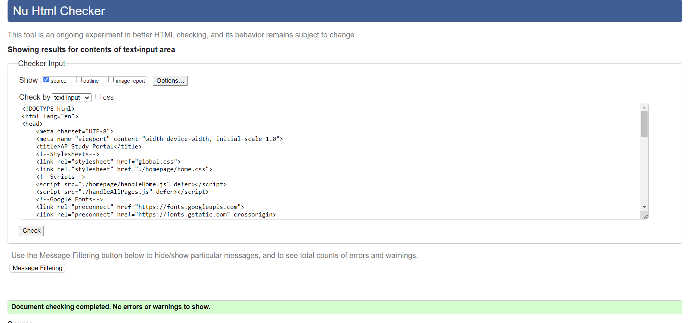

# HTML Documentation for Capstone

## DOCTYPE and HTML Structure
**index.html**
```html
<!DOCTYPE html>
```
**userstart.html**
```html
<!DOCTYPE html>
```
**flashcards.html**
```html
<!DOCTYPE html>
```
**apclass.html**
```html
<!DOCTYPE html>
```
**createlogin.html**
```html
<!DOCTYPE html>
```

## Lang Attribute

**index.html**
```html
<html lang="en">
```
**userstart.html**
```html
<html lang="en">
```
**flashcards.html**
```html
<html lang="en">
```
**apclass.html**
```html
<html lang="en">
```
**createlogin.html**
```html
<html lang="en">
```

## Meta Tags 
**index.html**
```html
<meta charset="UTF-8">
<meta name="viewport" content="width=device-width, initial-scale=1.0">
```

## Semantic Tags
**index.html**
```html
<header>
    <!--heading, welcome-->
    <h1 id="welcome" class="big-header">Welcome To <span class="accent" id="accent">AP Study Portal</span></h1>
    <div id="form">
        <!--username input for user-->
        <label for="user">Username:</label>
        <input id='user' name='user' type='text'><br>
        <!--password  input for user-->
        <label for="pass">Password:</label>
        <input id='pass' name='pass' type='password'>
        <!--submit button-->
        <button type='submit' id="authLogin" onclick="authorizeAcc()">Enter Account</button>
        
    </div>
    <h3>First Time With Us?<a id='create' href='./homepage/create-login/createlogin.html'>Create Login</a></h3>
    <h3>Leaving Us?<a id='create' onclick="deleteAcc()">Delete Login</a></h3>
        <button type="button" class="themeBtn">Invert Color Theme</button>
    
</header>
```

## Heading Structure
**index.html**
```html
<h1 id="welcome" class="big-header">Welcome To <span class="accent" id="accent">AP Study Portal</span></h1>
<div id="form">
    <!--username input for user-->
    <label for="user">Username:</label>
    <input id='user' name='user' type='text'><br>
    <!--password  input for user-->
    <label for="pass">Password:</label>
    <input id='pass' name='pass' type='password'>
    <!--submit button-->
    <button type='submit' id="authLogin" onclick="authorizeAcc()">Enter Account</button>
    
</div>
<h3>First Time With Us?<a id='create' href='./homepage/create-login/createlogin.html'>Create Login</a></h3>
<h3>Leaving Us?<a id='create' onclick="deleteAcc()">Delete Login</a></h3>
    <button type="button" class="themeBtn">Invert Color Theme</button>
```

## Alt Text For Images
**userstart.html**
```html


```

## Navigation
**index.html**
```html
<h3>First Time With Us?<a id='create' href='./homepage/create-login/createlogin.html'>Create Login</a></h3>
<h3>Leaving Us?<a id='create' onclick="deleteAcc()">Delete Login</a></h3>
```
**createlogin.html**
```html
<a href="../../index.html"><button type='button'>Back to Login Screen</button></a>
```

## Proper Structure
**index.html**
```html
<!--username input for user-->
<label for="user">Username:</label>
<input id='user' name='user' type='text'><br>
<!--password  input for user-->
<label for="pass">Password:</label>
<input id='pass' name='pass' type='password'>
```

## Button & Input Elements
**index.html**
```html
<button type='submit' id="authLogin" onclick="authorizeAcc()">Enter Account</button>
```
**userstart.html**
```html
<input type="search" id="class-search" oninput="searchCourses()"placeholder="Search for Your AP Class">
```

## Anchor Tags 
**index.html**
```html
<a id='create' onclick="deleteAcc()">Delete Login</a>
```

## External CSS / JS Links
**index.html**
```html
<!--Stylesheets-->
<link rel="stylesheet" href="global.css">
<link rel="stylesheet" href="./homepage/home.css"> 
<!--Scripts-->
<script src="./homepage/handleHome.js" defer></script>
<script src="./handleAllPages.js" defer></script>
<!--Google Fonts-->
<link rel="preconnect" href="https://fonts.googleapis.com">
<link rel="preconnect" href="https://fonts.gstatic.com" crossorigin>
<link href="https://fonts.googleapis.com/css2?family=Cal+Sans&family=Roboto+Condensed:ital,wght@0,100..900;1,100..900&display=swap" rel="stylesheet">
```

## Responsive Meta
**index.html**
```html
<meta name="viewport" content="width=device-width, initial-scale=1.0">
```

## Responsive Media and Images
**userstart.css**
```css
img {
    width: 50%;
    height: 50%;
    place-self: center;
}
```

## Lists
**index.html**
```html
<div class="available">
    <h2>Available Courses:</h2>
    <ul>
        <li>AP Human Geography</li>
        <li>AP Seminar</li>
        <li>AP World History</li>
        <li>AP Language and Composition</li>
        <li>AP United States History</li>
    </ul>
</div>
```

## Comments
**index.html**
```html
<!--heading, welcome-->
<h1 id="welcome" class="big-header">Welcome To <span class="accent" id="accent">AP Study Portal</span></h1>
<div id="form">
    <!--username input for user-->
    <label for="user">Username:</label>
    <input id='user' name='user' type='text'><br>
    <!--password  input for user-->
    <label for="pass">Password:</label>
    <input id='pass' name='pass' type='password'>
    <!--submit button-->
    <button type='submit' id="authLogin" onclick="authorizeAcc()">Enter Account</button>
    
</div>
<!--Create Login Prompt-->
<h3>First Time With Us?<a id='create' href='./homepage/create-login/createlogin.html'>Create Login</a></h3>
<!--Delete Account Prompt-->
<h3>Leaving Us?<a id='create' onclick="deleteAcc()">Delete Login</a></h3>
    <button type="button" class="themeBtn">Invert Color Theme</button>
<br>
<!--Available Course List-->
<div class="available">
    <h2>Available Courses:</h2>
    <ul>
        <li>AP Human Geography</li>
        <li>AP Seminar</li>
        <li>AP World History</li>
        <li>AP Language and Composition</li>
        <li>AP United States History</li>
    </ul>
```

## Indentation and Formatting
**flashcards.html**
```html
<div class="flashcard-container" id="flashcard-container">
    <div class="progress">
        <span id="current-card">1</span>/<span id="total-cards">5</span>
    </div>
    <div class="controls">
        <button id="prev-btn">Previous</button>
        <button id="flip-btn">Flip Card</button>
        <button id="next-btn">Next</button>
    </div>
    <div id="flashcard-display">
        <div class="controls">
            <button id="restart-btn">Start over</button>
            <button id="shuffle-btn">Shuffle Cards</button>
        </div>
    </div>
</div>
<button type="button" class="themeBtn">Invert Color Theme</button>
```

## Favicon 
**index.html**
```html
<!--Favicon-->
<link rel="icon" type="image/x-icon" href="./studypages/class%20icons/book.ico">
```

## W3C Check
✔ passes


